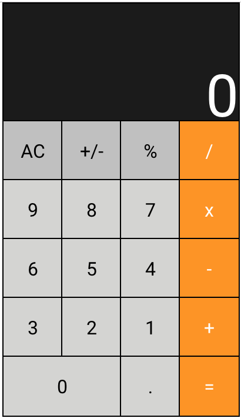

This project was bootstrapped with [Create React App](https://github.com/facebook/create-react-app).

## Live Version

https://calculator.victorialgodfrey.now.sh/

## About
Calculator was created with React.  

## Screenshot

## To Run Locally

Run  
`npm install`

`npm start`

## Limitations
1. Eval() is not always the most secure method, however for speed of build in this case I opted to use it
2. If a number with too many digits is entered users will receive an `ERROR`

## In Development
1. Limiting digits returned. 
2. Unit testing.
3. Some specific use cases give unexpected behavior.

## Updates

6/16/2019 - Users can no longer have a number with more than one period. 
